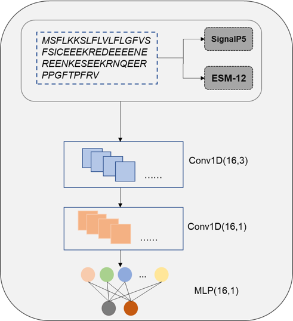
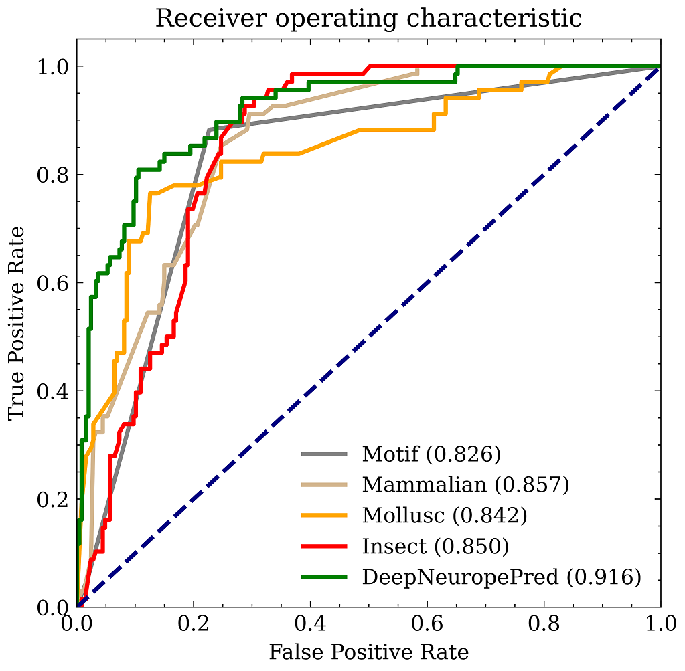

# DeepNeuropePred：a robust tool to predict cleavage sites in neuropeptide precursors

<!-- This repository is the official implementation of [My Paper Title](https://arxiv.org/abs/2030.12345).  -->

<!-- >📋  Optional: include a graphic explaining your approach/main result, bibtex entry, link to demos, blog posts and tutorials -->
We propose a novel deep learning framework "DeepNeuropePred", using a combination of pre-trained language model and Convolutional Neural Networks for feature extraction and predicting the neuropeptide cleavage sites.




## Requirements

To install requirements:

```setup
pip install -r requirements.txt
```

<!-- >📋  Describe how to set up the environment, e.g. pip/conda/docker commands, download datasets, etc... -->
🏷 Here, [SignalP5](http://www.cbs.dtu.dk/services/SignalP/portable.php) should be installed into your system environment


## Evaluation

To evaluate the model on the 31 test proteins, run:

```eval
python test.py --model-file ./pretrain_model/DeepNeuropePred.pth --input-fasta ./data/test.txt --ouput-json ./data/predict.json
```

<!-- >📋  Describe how to evaluate the trained models on benchmarks reported in the paper, give commands that produce the results (section below).

## Pre-trained Models

You can download pretrained models here:

- [My awesome model](https://drive.google.com/mymodel.pth) trained on ImageNet using parameters x,y,z. 

>📋  Give a link to where/how the pretrained models can be downloaded and how they were trained (if applicable).  Alternatively you can have an additional column in your results table with a link to the models. -->

## Results

Our model achieves the following performance on :




## Contact

If you have any questions, comments, or would like to report a bug, please file a Github issue or contact me at wanglei94@hust.edu.cn.